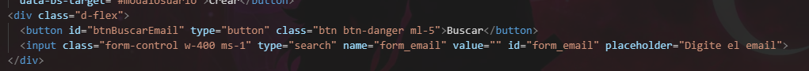
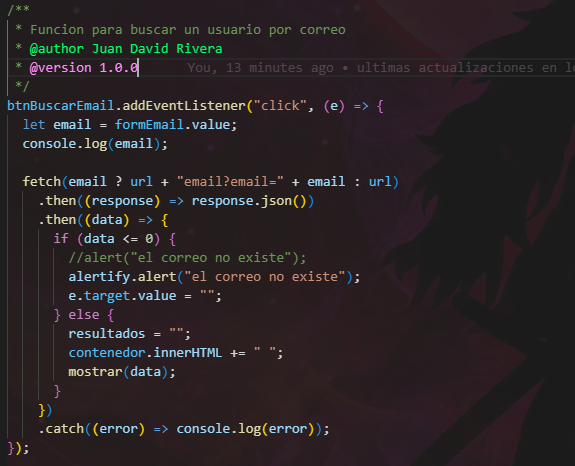
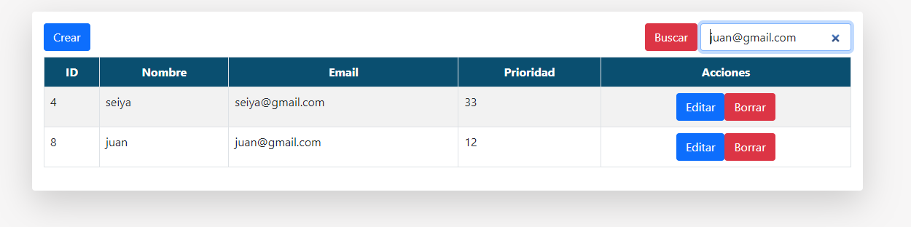
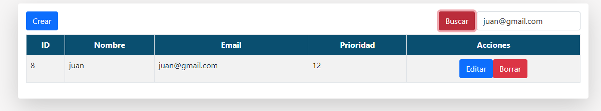
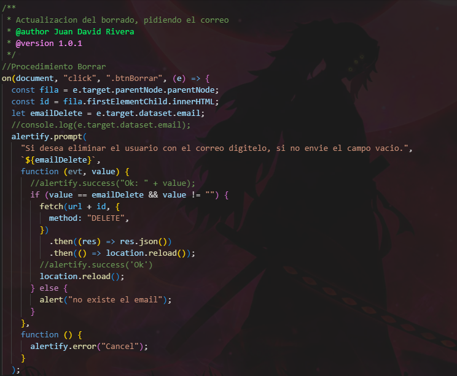
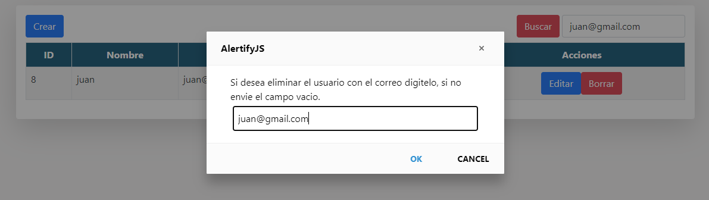

# crub-js-vanilla-frontend

frontend para consumir la api de spring boot

Se creo el boton y el input para la busqueda por email

Funcion para buscar el usuario por id

Se valida que el correo enviado sea correcto y si
se envia el campo vacio busca todos los usuarios

Funcion actualizada para pedir la eliminacion con
corre

borrar usuario con el correo, se valida igual que 
el correo sea correcto
